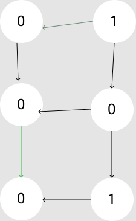
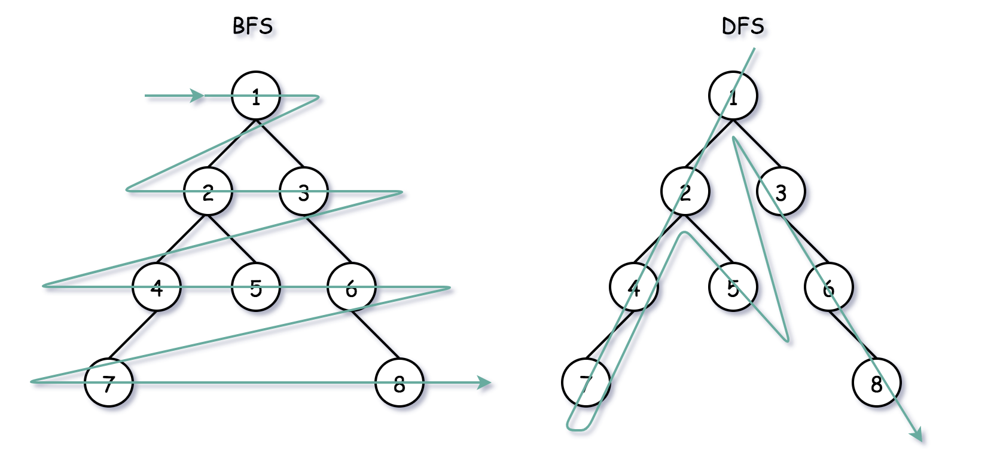

# Breadth first search \(Aka BFS\)

## Description

Bfs is used to find the path & shortest path in graph & tree structures.  Since it's breadth first, it first goes through the neighbours of the starting node & keep expanding from there until it accomplishes the shortest path or another goal.  
If we are able to convert our problem into a directed graph, we can easily apply bfs for a solution.

#### Example:

Given two words \(_beginWord_ and _endWord_\), and a dictionary's word list, find the length of shortest transformation sequence from _beginWord_ to _endWord_, such that:

1. Only one letter can be changed at a time.
2. Each transformed word must exist in the word list.

beginWord: "hot"  
endWord: "dog"  
wordList: \["hot","dot","dog","lot","log","cog"\]

Possible graph for this:


#### Example:

Given an `m x n` 2d `grid` map of `'1'`s \(land\) and `'0'`s \(water\), return _the number of islands_.

An **island** is surrounded by water and is formed by connecting adjacent lands horizontally or vertically. You may assume all four edges of the grid are all surrounded by water.

```text
Input: grid = [
  ["0","1"],
  ["0","0"],
  ["0","1"]
]
```

Possible graph for this:



As in the examples above, the given input should be able to be transformed to a graph to solve with BFS approach.

A binary tree can be also traversed with BFS



Let's say with the representation above, we want to go from d to e the shortest way.

Basic structure of a  BFS algorithm

```javascript
const startPoint = null
const queue = []; // establish a queue to iterate through from start
queue.push(startPoint);
while (queue.length > 0) {
    const size = queue.length;
    for (let i = 0; i < size; i++) {
        // iteration will vary depending on the problem
        // usually some logic to check current value against the goal
        // if the goal is not met, then add the current node's neighbors to 
        // the queue
    }
}
```

```javascript
// Also keeps track of visited nodes
function BFS(root, target) {
    const queue = []
    const visited = new Set()
    let step = 0
    queue.push(root)
    visited.add(root)
    const result = []
    while(queue.length) {
        step += 1
        const size = queue.length
        for(let i = 0; i < size; i++) {
            const cur = queue.shift()
            result.push(cur)
            if(cur === target) return [result, step]
            const neigbors = // of cur, implementation can vary
            for(let next of neighbors) {
                if(!visited.has(next)) {
                    queue.push(next)
                    visited.add(next)
                }
            }
        }
    }
    return [result, -1]
}
```

